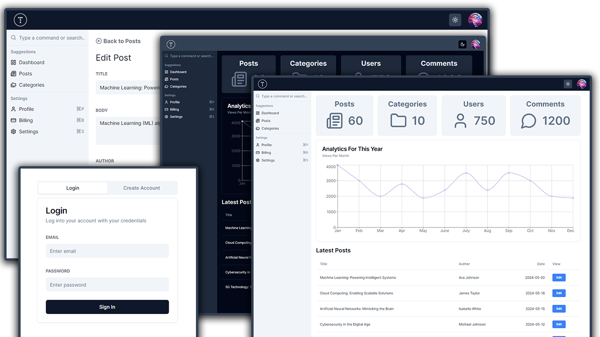

# TraversyPress UI



This is a admin dashboard UI built with Next.js. It is only the front-end interface so we are just using files for the data. Feel free to add on to it and make it a full stack project.

### Tutorial

This is part of tutorial by Traversy Media on Youtube [Admin Dashboard From Scratch - Next.js, TypeScript, Shadcn/ui](https://www.youtube.com/watch?v=hhudoSMM0yU).

### Packages Used

- Next.js/React
- TypeScript
- Shadcn/ui
- Tailwind CSS
- Recharts
- Lucide React
- React Hook Form
- Zod
- Next Themes

## Getting Staretd

Install dependencies:

```bash
npm install
```

Run the development server:

```bash
npm run dev
# or
yarn dev
# or
pnpm dev
# or
bun dev
```

Open [http://localhost:3000](http://localhost:3000) with your browser to see the result.
